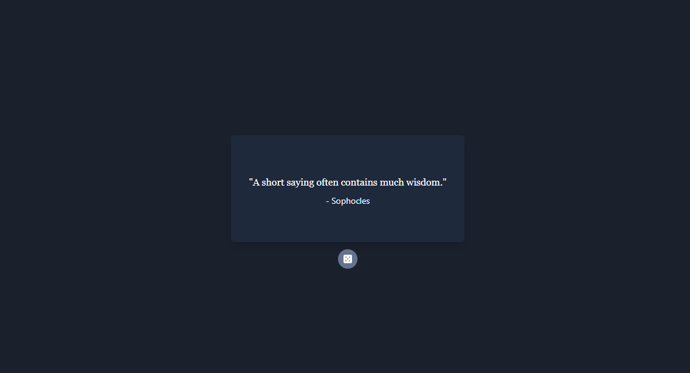

# Random Quote Generator



A simple random quote generator that uses the [Quotable API](https://github.com/lukePeavey/quotable) to fetch quotes.

<https://nextjs-quote-generator.vercel.app/>

## Built With

- [Next.js](https://nextjs.org/) - A React framework with hybrid static & server rendering, and route pre-fetching, etc.
- [React](https://reactjs.org/) - Component-based UI framework for JS
- [Tailwind CSS](https://tailwindcss.com/) - A utility-first CSS framework
- [React Icons](https://react-icons.github.io/react-icons/) - Icon set

## Getting Started

To get a local copy up and running follow these simple steps.

### Prerequisites

- pnpm

```sh
npm install -g pnpm
```

### Installation

1. Clone the repo

```sh
git clone https://github.com/julianchong00/nextjs-quote-generator.git
```

2. Install NPM packages

```sh
pnpm install
```

3. Run the development server

```sh
pnpm dev
```

4. Open [http://localhost:3000](http://localhost:3000) with your browser to see the result.

## License

Distribution is licensed under the MIT license. See [LICENSE](./LICENSE) for more information.
